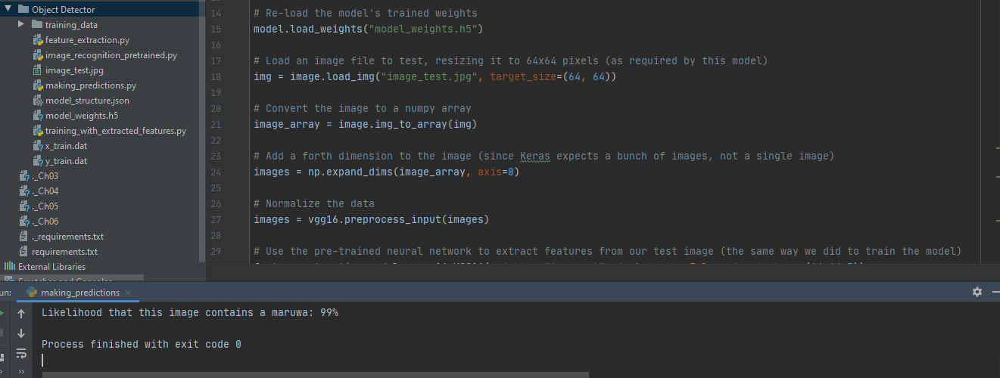

# Machine Learning:Object Detector

Using a pretrained network to design a new object detection model using Transfer Learning

PROJECTS TOPIC: Building a new object detection model using Transfer Learning

In this project I explore machine learning by creating an object detection system for a tricycle. Tricycle is one of the common means of transportation in West Africa. I decided to choose tricycle because it is not yet trained in the dataset I am using. For the sake of distinction, I am giving it the local name it is called in one of the West African countries; Keke Maruwa. So let&#39;s start!

**Some definitions:**

**Transfer Learning** is using a model trained on one set of data as a starting point for modelling a new set of data.

**Convolutional Network** : A typical convolutional neural network is made up of a series of convolutional layers and the training process teaches each of those layers to be activated when it sees certain patterns in the input image. Convolutional neural network processes an image layer by layer.

**Transfer Learning** : With transfer learning, we will use a neural network that&#39;s already been trained to recognize objects from a large dataset. We will then add our own design to it. The following are the steps:

1. Slice off the last layer. All the layers that detect patterns will be kept, but we will remove the part that maps those patterns to specific objects. Let us name the result here a **feature extractor**
2. Create a new neural network to replace the last layer that we sliced off from the original network. We will need to train this part ourselves.
3. In order to build our own new image recognition system, we&#39;ll pass our new training images(in this project case: **Keke Maruwa** ) through the feature extractor(that we created in step 1) and save the results for each training image to a file.
4. Use those extracted features to train the new neural network. Since we&#39;re using the feature extractor to recognize shapes and patterns, our new neural network only has to learn to tell which patterns map to which objects. Since this new neural network isn&#39;t doing much work, it can learn to do it with a small amount of training data. And here&#39;s how we&#39;ll do predictions with transfer learning.
5. When we want to test the new image, we have to first pass it through the same feature extractor. Then we can use those extracted features as input to our newly-trained neural network, which will give us the final prediction.

**STEPS IN PICTURES**

**Overview of convolutional neural network:**

We will slice off the last layer

We will create a new last layer

we will pass our new training images to a feature extractor and save the output to a file

we will use the extracted feature to train a new neural network

final design

For this projects I have 17 images of different types of Keke Maruwa to train my model. I also have another 13 images that are different from Keke Maruwa to train the model on things that are not Keke Maruwa. There is another image &quot;image\_test&quot; which will be used to test this model after

IMAGES OF KEKE MARUWA USED:

IMAGES THAT HER NOT KEKE MARUWA. THESE ARE ALSO USED DURING TRAINING:

EXAMPLE OF WHAT I HAD IN KEKE MARUWA FOLDER:

EXAMPLE OF WHAT I HAD IN NOT_MARUWA FOLDER:

1. Testing images of maruwa on the pretrained network before our own model:

 
All picture size should be 64 x 64 pixels. We generated x_train.dat and y_train.dat

FEATURE EXTRATION ENDED:

TRAINING WITH EXTRACTED FEATURE:

model_structure.json, model_weights.h5 generated

Making prediction: Testing new model: This picture was used to test the new model, this was not used during training of the model:

Final prediction:

